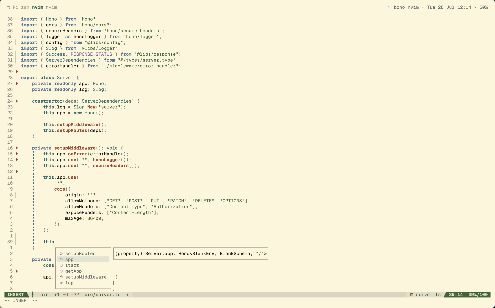

# bono.nvim

A warm muted colorscheme for Neovim — cream (light) and espresso (dark) variants.

> **Note:** The espresso (dark) variant is still a work in progress.



Inspired by the structure of [token.nvim](https://github.com/your-username/token.nvim), with its own warm palette.

## Installation

```lua
-- lazy.nvim
{
  "aadielpr/bono.nvim",
  lazy = false,
  priority = 1000,
  config = function()
    require("bono").setup()
    vim.cmd("colorscheme bono")
  end,
}
```

## Config

```lua
require("bono").setup({
  variant = "cream",          -- nil = auto-detect from vim.opt.background, "cream", or "espresso"
  transparent = false,    -- transparent background
  dim_inactive = false,   -- dim inactive windows
  styles = {
    bold = {
      comments = false,
      keywords = true,
      functions = false,
      strings = false,
      imports = true,
      variables = false,
      booleans = true,
    },
    italic = {
      comments = false,
      keywords = false,
      functions = false,
      strings = false,
      imports = false,
      variables = false,
      booleans = false,
    },
  },
})
```

## Plugin support

Highlights for:

- [blink.cmp](https://github.com/Saghen/blink.cmp)
- [telescope.nvim](https://github.com/nvim-telescope/telescope.nvim)
- [neo-tree.nvim](https://github.com/nvim-neo-tree/neo-tree.nvim)
- [oil.nvim](https://github.com/stevearc/oil.nvim)
- [diffview.nvim](https://github.com/sindrets/diffview.nvim)
- [gitsigns.nvim](https://github.com/lewis6991/gitsigns.nvim)
- [which-key.nvim](https://github.com/folke/which-key.nvim)
- [flash.nvim](https://github.com/folke/flash.nvim)
- [trouble.nvim](https://github.com/folke/trouble.nvim)
- [snacks.nvim](https://github.com/folke/snacks.nvim)
- [indent-blankline.nvim](https://github.com/lukas-reineke/indent-blankline.nvim)
- [rainbow-delimiters.nvim](https://github.com/HiPhish/rainbow-delimiters.nvim)
- [render-markdown.nvim](https://github.com/MeanderingProgrammer/render-markdown.nvim)
- [treesitter-context](https://github.com/nvim-treesitter/nvim-treesitter-context)
- [mason.nvim](https://github.com/williamboman/mason.nvim)
- [lualine.nvim](https://github.com/nvim-lualine/lualine.nvim)
- [harpoon.nvim](https://github.com/ThePrimeagen/harpoon)
- [undotree](https://github.com/mbbill/undotree)
